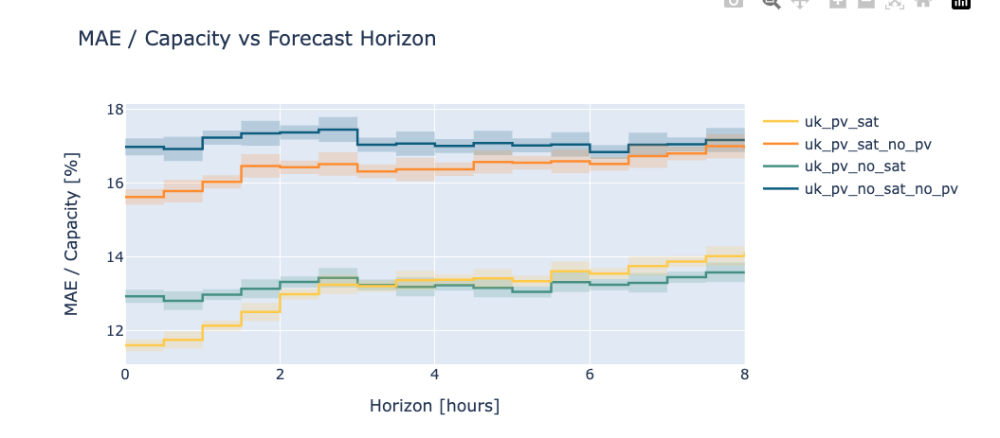

## Backtest using Satellite

We've added satellite data into our model. 
We use the satellite data from google public dataset's [here](gs://public-datasets-eumetsat-solar-forecasting/satellite/EUMETSAT/SEVIRI_RSS/v4/)

The backtest was trained on 2018 and 2019 data and tested on 2020 and 2021 data.

For satellie data we use all the channels, and take an average over 5 by 5 pixels closes to the PV system. 

```bash
poetry run python psp/scripts/train_model.py -n uk_pv -c uk_pv -b 1
```

If we don't include live PV data, and just forecast up to 8 hours ahead,
we get the following results:
The 0 hour improves from 17.0 to 15.6. This is a 9% improvement.
By 8 hours we see very little improvement.
This was run with 20,000 


If we include live PV data, and just forecast up to 8 hours ahead,
we get the following results:
The 0 hour improves from 12.9 to 11.6. This is a 10% improvement.
By 8 hours we see very little improvement.



| config name | NWP | Live PV | Satellite |
|-------------|-----|---------|-----------|
| uk_pv_sat_no_pv | x | | x |
| uk_pv_no_pv | x | | |
| uk_pv_sat | x | x | x |
| uk_pv | x | x | |


We don't believe Satellite data adds any value to model after ~2 hours when we include live PV data. 


